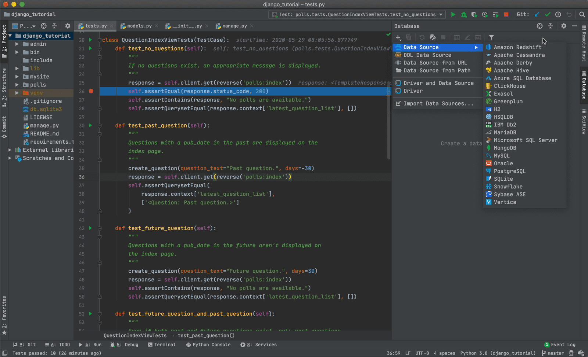

_The title is slightly misleading, because I want to talk about code editors in general,_
_but you get the point._
{:note}

* toc
{:toc}

## Background

You just started your journey to become a programmer and you chose Python. It's indeed
a great choice: its simplicity, plain English keywords, and quick installation make Python
a preferred language for new players. But, as you get used to the plain Python IDLE that
comes built-in, you ask yourself if there's a better way to write code, _literally?_

## What is an IDE?

An IDE, which stands for Integrated Development Environment, is a program that are created to
make your coding experience much less excruciating. An IDE, first of, is a code editor, but it's
fully equipped with a compiler (or for Python, an interpreter), a debugger, a profiler, etc.
in other words, everything you need to create a meaningful program from start to finish.

For C-like and similarly designed languages, an IDE's absolutely a lifesaver. You sure never
experience the hardship when you have to run so many commands just to get your programs running,
not to mention things like debugging, profiling, and packaging. You also have to do all these
again when you update your code.

On the other hand, for Python and languages with an intepreter, the development cycle is much
shorter and easier. Thus, IDEs don't add as much more value as compared to the cases above.

As such, I will be discussing about both IDEs and code editors in this post and let you to be
the judge of what you prefer.

## Criteria for choosing an IDE

These are things that you should worry about when choosing yourself a brand new IDE or code editor.
They are, not in order of importance:

1. **Ease of use**: A good code editor shouldn't ask you to install many packages to start working,
like version control, package management, etc.

2. **Cost**: There are many good editors out there, but some come at a cost. Depending on your
needs and commitment, you can choose a free editor or spare some money for a proprietary software.
Note that expensive ones aren't necessarily better than free ones.

3. **Speed**: I'm not talking about the speed of the interpreter, but of the code editor, like how
smoothly you can navigate around a large project, or whether you can open a very large text file
without waiting for more than a few seconds.

## Great code editors for Python (in my opinion)

1. **PyCharm**

    `PyCharm` is really one of the best IDEs out there, as it's specificaly designed for Python
    development. It comes built-in with a package manager, Python environment manager, etc. It'll
    certainly make getting a project running a tad easier.

    

    However, due to its extensive functionality, it can be overwhelming if you've just started
    programming in general. PyCharm comes in 2 versions: a free Community Edition and a paid
    Professional Edition, as a subscription. Personally, I feel that the Community Edition is
    enough for most people, but the latter makes working with scientific computing and web
    development, two of the most popular usages of Python, easier.

    **Pros**:

    * Is very powerful with a lot of functionality

    * Has a free version for general Python programming

    **Cons**:

    * Can be overwhelming to amateur programmers

    * A paid version for more advanced usages is a little bit expensive

    For more information, you can visit their website [here][pycharm-link].

2. **Visual Studio Code**

    `Visual Studio Code` is a general, open-source code editor that you can use to work with almost
    all programming languages. As it's just an editor, it doesn't come with as many functionality as
    PyCharm, though most of them can be installed easily through the extension manager.

    

    However, Visual Studio Code has its own drawback. It's built on the Electron framework, which is
    notoriously known for its slow startup time. However, it's unnoticeable for most users. It also
    comes with built-in partial support for GitHub, and it can be extended with both Microsoft- and
    community-supported extensions for everything, from code linting to packaging.

    **Pros**:

    * Is super lightweight and extensible

    * Has broad community for support

    **Cons**:

    * Needs to install quite some extensions to get working

    * Is slightly slower than other code editors

    For more information, you can visit their website [here][vscode-link].

## Conclusion

The reason I only cover the two code editors is because they can be used interchangeably. There are
many great code editors out there that are covered by experienced programmers. However, I truly
believe that these two are really powerful while being easy to set up and use. Personally, I use
PyCharm for pure Python projects, and Visual Studio Code for other mixed projects.

[pycharm-link]: https://www.jetbrains.com/pycharm/
[vscode-link]: https://code.visualstudio.com
